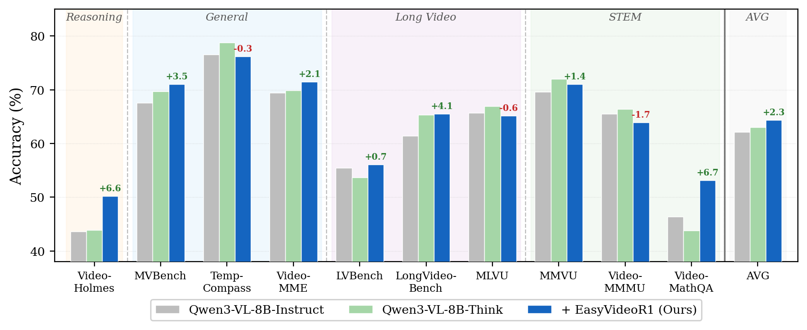
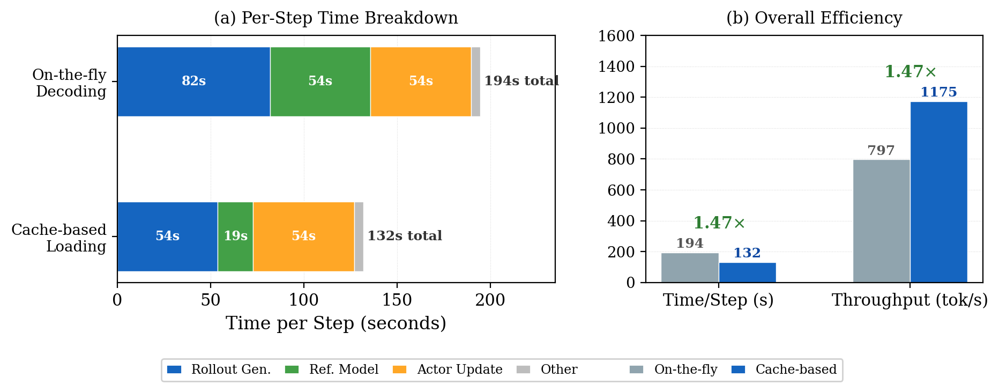

# EasyVideoR1: Easier RL for Video Understanding

[English](README.md)

在推进多模态大语言模型后训练以提升视频理解能力的过程中，我们发现现有的强化学习框架在视频理解场景中适配的不太好。因此，我们构建了EasyVideoR1来实现相关优化，具体内容已在[report](https://github.com/cyuQ1n/EasyVideoR1/blob/main/EasyVideoR1-report.pdf)中概述。据我们所知，这应该是迄今为止最适合视频理解RL研究的代码仓库。它支持广泛的视频理解任务，融入了适合社区进行后训练研究和探索的接口（off-policy与on-policy混合训练、图像-视频联合训练），通过系统化设计提升了视频强化学习的训练效率，并提供了高效、全面且与已对齐准确率的视频理解评测框架。我们希望这个仓库能够激发多模态社区对视频理解研究的热情。我们也呼吁社区研究人员加入我们，共同维护这个代码库，携手打造最全面、最适合学术探索的视频理解RL仓库。我们欢迎并会认真考虑合并任何有价值的pull request。

> 分支说明
>
> 当前分支作为 **Qwen3.5 RL 训练分支** 维护。公开训练入口是 [`examples/video_rl_qwen3.5/video_rl_v1_dapo.sh`](examples/video_rl_qwen3.5/video_rl_v1_dapo.sh)，公开配置是 [`examples/video_rl_qwen3.5/video_rl_v1_qwen3_5.yaml`](examples/video_rl_qwen3.5/video_rl_v1_qwen3_5.yaml)。已验证的运行环境导出文件位于 [`docs/environment/`](docs/environment/README.md)。

## 📍 特性

### 视频友好的RL管线优化
-  1. 离线预处理与基于缓存的训练：rollout生成加速1.5倍，log-probability计算加速2.9倍，**整体单步时间和token吞吐量均实现1.47倍加速**。
-  2. 任务感知提示与奖励分配系统：**支持10+种任务类型及其准确率评分/奖励方法**。具体而言，EasyVideoR1默认完整实现了以下奖励类型：选择题、数值题、时序定位、时空定位、开放式问答。此外，提示词格式也已为以下额外任务类型准备就绪：空间定位、Tracking、OCR、布尔问答、数学和代码生成。
-  3. 更灵活的视频超参数设置：支持视频元数据以实现精确的帧处理。
-  4. 先进视觉语言模型：支持 **Qwen2-VL / Qwen2.5-VL / Qwen3-VL / Qwen3.5-VL** 系列视觉语言模型。
-  5. 丰富的强化学习算法：继承自 [EasyR1](https://github.com/hiyouga/EasyR1)，支持 **GRPO、DAPO、GSPO、CISPO、Reinforce++、ReMax、RLOO、GDPO** 等多种算法。
### 算法开发研究友好接口
-  1. 混合模态流程适配：通过优化梯度流，**支持联合文本-图像-视频训练**。
-  2. 轻量级混合策略接口：**支持在线-离线混合训练（mix policy）**。
### 快速全面的评估框架
-  1. 异步推理：预计算帧缓存与异步流水线结合AsyncLLMEngine，确保GPU在每个调度步骤都保持高效：缓存I/O持续供给数据，异步队列消除批次边界停滞，分块预填充防止任何单一长序列独占计算资源。
-  2. 全面且可复现的评估：支持22+个视频理解基准测试。
-  3. 精度对齐：对于Qwen3-VL系列模型，**评测结果与官方精度对齐（偏差在1%以内）**。
      
## 🏆 性能

使用 EasyVideoR1 训练后，在 10 个视频理解基准测试上相比 Qwen3-VL-8B 基座模型取得了一致的提升，平均准确率提升 **+2.3%**。

<div align="center">
  
</div>

视频预处理缓存机制相比实时解码，将单步训练速度提升 **1.47 倍**，且不影响精度。

<div align="center">
  
</div>

## 📐 安装

这个分支已经用 `easyvideor1-for-qwen3.5` 环境验证过。环境导出文件如下：

- [`docs/environment/easyvideor1-for-qwen3.5.conda.yaml`](docs/environment/easyvideor1-for-qwen3.5.conda.yaml)
- [`docs/environment/easyvideor1-for-qwen3.5.conda-explicit.txt`](docs/environment/easyvideor1-for-qwen3.5.conda-explicit.txt)
- [`docs/environment/easyvideor1-for-qwen3.5.pip-freeze.txt`](docs/environment/easyvideor1-for-qwen3.5.pip-freeze.txt)
- [`docs/environment/easyvideor1-for-qwen3.5.summary.txt`](docs/environment/easyvideor1-for-qwen3.5.summary.txt)

推荐安装方式：

```bash
conda env create -f docs/environment/easyvideor1-for-qwen3.5.conda.yaml
conda activate easyvideor1-for-qwen3.5

git clone https://github.com/cyuQ1n/EasyVideoR1.git
cd EasyVideoR1
pip install -e .
```

如果你只想安装 Python 层依赖，也可以参考 [`requirements.txt`](requirements.txt)。但精确复现当前分支已验证环境时，请以 `docs/environment/` 里的导出文件为准。

已验证的关键版本：

- Python `3.11.14`
- PyTorch `2.10.0+cu129`
- Transformers `5.5.4`
- vLLM `0.19.1`
- Ray `2.54.0`
- qwen-vl-utils `0.0.14`
- flash-attn `2.8.3`
- flash-linear-attention `0.4.2`
- torchcodec `0.11.1`

## 🚀 快速开始

当前分支推荐直接使用 `examples/video_rl_qwen3.5/` 下的 Qwen3.5 训练管线。

### 第一步：确认示例配置里的默认路径

当前提交的 Qwen3.5 示例假设你使用的是一套预处理后的视频 RL 数据布局：

- 模型：`/path/to/Qwen3.5-2B`
- 训练数据：`/path/to/train.jsonl`
- 验证数据：`/path/to/val.jsonl`
- 预处理视频缓存：`/path/to/preprocessed_pt_dir`

这些默认值都写在 [`examples/video_rl_qwen3.5/video_rl_v1_qwen3_5.yaml`](examples/video_rl_qwen3.5/video_rl_v1_qwen3_5.yaml) 里。如果你不是在我们的内部环境运行，请先替换掉这些路径。

可以直接编辑 YAML，也可以通过环境变量覆盖：

```bash
export EASYVIDEORL_MODEL_PATH=/abs/path/to/Qwen3.5-2B
export EASYVIDEORL_TRAIN_FILES=/abs/path/to/train.jsonl
export EASYVIDEORL_VAL_FILES=/abs/path/to/val.jsonl
export EASYVIDEORL_PREPROCESSED_VIDEO_DIR=/abs/path/to/preprocessed_pt_dir
export EASYVIDEORL_VAL_PREPROCESSED_VIDEO_DIR=/abs/path/to/preprocessed_pt_dir
```

### 第二步：查看当前分支的 Qwen3.5 训练文件

- 启动脚本：[`examples/video_rl_qwen3.5/video_rl_v1_dapo.sh`](examples/video_rl_qwen3.5/video_rl_v1_dapo.sh)
- 训练配置：[`examples/video_rl_qwen3.5/video_rl_v1_qwen3_5.yaml`](examples/video_rl_qwen3.5/video_rl_v1_qwen3_5.yaml)
- 适配说明：[`docs/qwen3_5_adaptation_notes.md`](docs/qwen3_5_adaptation_notes.md)

当前分支已经把 Qwen3.5 示例整理成“预处理 JSONL + PT 缓存”的通用训练布局，并将 prompt 模板与 reward 逻辑一并放在 `examples/video_rl_qwen3.5/` 下。

### 第三步：启动训练

```bash
# 单机训练
bash examples/video_rl_qwen3.5/video_rl_v1_dapo.sh

# 多机训练
WORLD_SIZE=2 RANK=0 MASTER_ADDR=<主节点IP> bash examples/video_rl_qwen3.5/video_rl_v1_dapo.sh
WORLD_SIZE=2 RANK=1 MASTER_ADDR=<主节点IP> bash examples/video_rl_qwen3.5/video_rl_v1_dapo.sh
```

脚本默认使用的 Conda 环境名是：

```bash
easyvideor1-for-qwen3.5
```

如果需要，也可以通过 `CONDA_ENV_PREFIX` 或 `CONDA_ENV_NAME` 覆盖。

训练完成后，可以将 FSDP 检查点合并为 Hugging Face 格式：

```bash
python3 scripts/model_merger.py --local_dir checkpoints/qwen3_5_onethinker100k/<experiment>/global_step_*/actor
```

## 📂 项目结构

```
EasyVideoR1/
├── verl/                       # 核心 RL 训练框架
│   ├── trainer/                # 训练循环 & Ray 编排
│   ├── workers/                # Actor、rollout、reward、critic workers
│   ├── models/                 # Qwen2-VL / Qwen2.5-VL / Qwen3-VL 模型支持
│   └── utils/                  # 数据集、分词、FSDP 工具
├── examples/
│   ├── video_rl/               # 原始纯视频 RL 管线
│   ├── video_rl_qwen3.5/       # 当前分支主要公开的 Qwen3.5 视频 RL 管线
│   └── unified_rl/             # 图文视频混合管线（模块化 reward）
├── eval/                       # 评测工具集（25+ 基准测试）
├── scripts/                    # 检查点合并、视频预处理
└── docs/                       # 详细文档与环境导出
```

## 🔧 示例管线

### Video RL (`examples/video_rl/`)

单文件自包含的纯视频 RL 训练管线。reward 函数 (`video_reward.py`) 在一个文件中处理所有任务类型，使用 `accuracy * 0.9 + format * 0.1` 的简单加权公式。

```bash
bash examples/video_rl/run_video_rl.sh
```

### Qwen3.5 Video RL (`examples/video_rl_qwen3.5/`)

这是当前分支的主训练路径，包含：

- `verl/models/transformers/qwen3_5.py` 中的 Qwen3.5 模型适配
- Qwen3.5 的 position id 路由
- 多机启动脚本 `video_rl_v1_dapo.sh`
- Qwen3.5 配置 `video_rl_v1_qwen3_5.yaml`

```bash
bash examples/video_rl_qwen3.5/video_rl_v1_dapo.sh
```

### Unified RL (`examples/unified_rl/`)

模块化的图文视频混合训练管线。reward 函数根据每条样本的 `problem_type` 自动路由到对应的任务模块（多选题、grounding、数学等），各模块独立评分。

```bash
bash examples/unified_rl/run_unified_rl.sh
```

## 📖 详细文档

| 文档 | 说明 |
|------|------|
| [配置参数参考](docs/config_parameters.md) | 所有 YAML 配置选项的完整说明 |
| [Qwen3.5 适配说明](docs/qwen3_5_adaptation_notes.md) | 当前分支中与 Qwen3.5 训练相关的模型和训练改动 |
| [环境导出](docs/environment/README.md) | 当前 Qwen3.5 分支已验证运行环境的导出文件 |
| [RL 训练深度解析](docs/rl_training_deep_dive.md) | GRPO 算法、系统架构、训练流程 |
| [Qwen3-VL 多模态处理](docs/qwen3_vl_multimodal_processing.md) | 视觉语言模型内部机制 |
| [Token 计算](docs/token_calculation.md) | Token 计数与显存估算 |

## ❓ 常见问题

**问：`Image features and image tokens do not match`**

答：增大 `data.max_prompt_length` 或减小 `data.max_pixels`。

**问：CUDA out of memory**

答：减小 `worker.rollout.gpu_memory_utilization` 并启用 `worker.actor.offload.offload_params`。

**问：多节点训练卡住**

答：使用 `ray status` 检查集群状态，确保所有节点已连接且 NCCL 端口已开放。

## 🙏 致谢

本项目基于以下优秀工作构建：
- [EasyR1](https://github.com/hiyouga/EasyR1) — 高效可扩展的 RL 训练框架
- [veRL](https://github.com/volcengine/verl) — 高性能 RL 与 HybridEngine
- [OneThinker](https://github.com/tulerfeng/OneThinker) - 图和视频的联合RL框架
- [ms-swift](https://github.com/modelscope/ms-swift) — Qwen3.5 相关环境设置还参考了官方的 [Qwen3.5 最佳实践](https://swift.readthedocs.io/zh-cn/latest/BestPractices/Qwen3_5-Best-Practice.html) 以及 `ms-swift` 代码仓库。

## 📄 引用

如果使用本项目，请引用 EasyR1 和 veRL：

```bibtex
@misc{zheng2025easyr1,
  title        = {EasyVideoR1: Easier RL for Video Understanding},
  author       = {},
  howpublished = {\url{https://github.com/cyuQ1n/EasyVideoR1}},
  year         = {2026}
}
```

## 📜 许可证

本项目遵循与 [EasyR1](https://github.com/hiyouga/EasyR1) 相同的许可证。

## ☎️ 我们正在招聘！

我们（京东探索研究院多模态理解研究部）正在招聘多模态大模型研究员和实习生！如果你有顶级会议/期刊论文发表，并对视频理解和视觉语言模型（VLMs）充满热情，请将简历发送至：siqingyi.phoebus@jd.com。期待你的加入！
